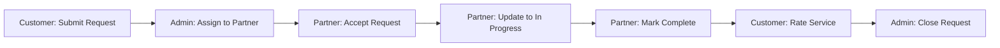

# Customer Portal Testing Guide

## 🎯 Overview

The customer portal provides a web-based interface for testing the **exact same APIs** that the mobile application will use. This allows you to validate the complete request journey without needing a mobile app.

---

## 🚀 Quick Start

### Access the Customer Portal

Simply navigate to:
```
http://localhost:3000/customer/requests
```

**That's it!** A test customer token will be **automatically generated** on your first visit.

---

## 🔑 How Authentication Works

### Automatic Token Generation

When you visit any `/customer/*` page:

1. The system checks for an existing `customerToken` in localStorage
2. If none exists, it automatically calls `POST /api/customer/test-token`
3. This creates or retrieves a test customer user:
   - **Email:** `test.customer@example.com`
   - **Name:** `Test Customer`
   - **Phone:** `+966500000000`
   - **User Type:** `customer`
4. A valid JWT token is generated and stored in localStorage
5. You're automatically authenticated and ready to test!

### Test Customer Details

The test customer is created once and reused across sessions:
- **Persistent:** The same user is used each time
- **Isolated:** Separate from admin/partner users
- **Safe:** Only used in test environment

---

## 📋 Testing Workflow

### 1. Submit a Request
**URL:** `http://localhost:3000/customer/requests/new`

1. Select a service category (e.g., "Car Maintenance")
2. Choose a pickup option (e.g., "Pickup Only")
3. Optionally select a specific service
4. Fill in your information:
   - Name
   - Phone
   - Address
5. Set your location on the map (or use "Use My Current Location")
6. Click **"Submit Request"**
7. ✅ See your request number and confirmation

### 2. Track Requests
**URL:** `http://localhost:3000/customer/requests`

- View all your submitted requests
- See current status with color-coded badges
- Click any request to view details

### 3. View Request Details
**URL:** `http://localhost:3000/customer/requests/[id]`

- See complete request information
- View service and location details
- Track status timeline with timestamps
- See assigned partner and branch (when assigned)
- **Rate the service** when completed (1-5 stars + feedback)

---

## 🔄 Complete End-to-End Test



### Step-by-Step:

1. **Customer Portal** (`/customer/requests/new`)
   - Submit a new request
   - Note the request number

2. **Admin Portal** (`/admin/requests`)
   - Find the new request (status: "submitted")
   - Assign it to a partner branch

3. **Partner Portal** (`/partner/requests`)
   - See the assigned request
   - Accept within 15 minutes
   - Update status to "In Progress"
   - Mark as "Completed"

4. **Customer Portal** (`/customer/requests/[id]`)
   - See status updates in timeline
   - Rate the service (stars + feedback)

5. **Admin Portal** (`/admin/requests/[id]`)
   - Verify completion
   - Close the request

✅ **Complete Request Lifecycle Validated!**

---

## 🔧 API Endpoints Used

All requests use the **production customer API endpoints**:

```typescript
// Authentication
POST   /api/customer/test-token          // Generate test token (TEST ONLY)

// Requests
POST   /api/customer/requests            // Create request
GET    /api/customer/requests            // List all requests
GET    /api/customer/requests/:id        // Get request details
POST   /api/customer/requests/:id/rate   // Rate completed request

// Public (no auth required)
GET    /api/categories                   // Get service categories
GET    /api/pickup-options               // Get pickup options
GET    /api/services?categoryId=X        // Get services by category
```

---

## 🧪 Testing Tips

### 1. Fresh Start
To get a fresh test customer token:
```javascript
// In browser console:
localStorage.removeItem('customerToken');
// Then refresh the page
```

### 2. Check Request Status
- Requests start as "submitted"
- After admin assigns: "assigned"
- After partner accepts: "confirmed"
- During service: "in_progress"
- After completion: "completed"
- After admin closes: "closed"

### 3. Test Rating
- Only available when status is "completed"
- Select 1-5 stars
- Optionally add feedback text
- Rating is permanent (can't be changed)

### 4. Test Location
- Click map to set custom location
- Or use "Use My Current Location" button
- Coordinates are saved with the request

---

## 🌍 Bilingual Testing

The portal supports both English and Arabic:

1. Click the **Globe icon** in the navigation
2. Switch between EN ↔ AR
3. Notice:
   - Text direction changes (LTR ↔ RTL)
   - All labels translate
   - Layout mirrors properly

---

## 🐛 Troubleshooting

### No Token Generated
**Issue:** Customer portal shows loading forever

**Solution:**
```bash
# Check if the API is running
curl -X POST http://localhost:3000/api/customer/test-token

# Check browser console for errors
# Clear localStorage and try again
```

### Request Submission Fails
**Issue:** Form submission returns error

**Solution:**
- Check all required fields are filled
- Ensure location is set on map
- Verify token is valid (check network tab)
- Check backend logs for detailed error

### Can't See Requests
**Issue:** Request list is empty

**Solution:**
- Verify you're using the test customer token
- Check database for requests with your customer ID
- Try submitting a new request

---

## 📊 Database Queries

### Find Test Customer
```sql
SELECT * FROM users 
WHERE email = 'test.customer@example.com' 
AND user_type = 'customer';
```

### View Test Customer's Requests
```sql
SELECT 
  r.id,
  r.request_number,
  r.status,
  r.created_at,
  c.name as category_name
FROM requests r
JOIN categories c ON r.category_id = c.id
JOIN users u ON r.customer_id = u.id
WHERE u.email = 'test.customer@example.com'
ORDER BY r.created_at DESC;
```

---

## ⚠️ Important Notes

1. **Test Token Only:** The `/api/customer/test-token` endpoint is for **TESTING ONLY**
   - In production, customers will authenticate via the mobile app
   - This endpoint should be disabled or protected in production

2. **Same APIs as Mobile:** All endpoints used here are the **exact same** ones the mobile app will call

3. **Data Persistence:** Test customer data persists across sessions
   - All requests are real database records
   - Use the same test customer for consistency

4. **Not for Production:** This portal is a **testing tool**
   - Real customers will use the mobile application
   - This validates that APIs work correctly

---

## 🎯 Success Criteria

After testing, you should be able to confirm:

- ✅ Customer can submit requests with all required fields
- ✅ Requests appear immediately in admin portal
- ✅ Admin can assign requests to partners
- ✅ Partners receive and can accept requests
- ✅ Status updates propagate to customer view
- ✅ Customer can track requests in real-time
- ✅ Customer can rate completed services
- ✅ Complete request lifecycle works end-to-end
- ✅ All APIs function correctly
- ✅ Mobile app developers can use same endpoints

---

## 📞 Support

For issues or questions:
1. Check browser console for errors
2. Check backend logs for API errors
3. Verify database state with SQL queries above
4. Review API responses in Network tab

---

**Happy Testing! 🚀**


